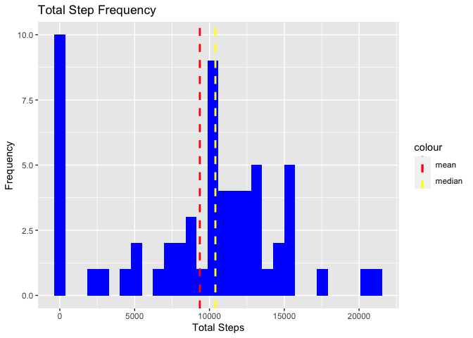
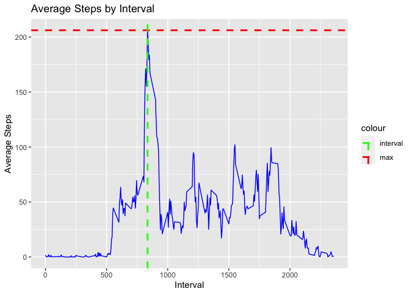
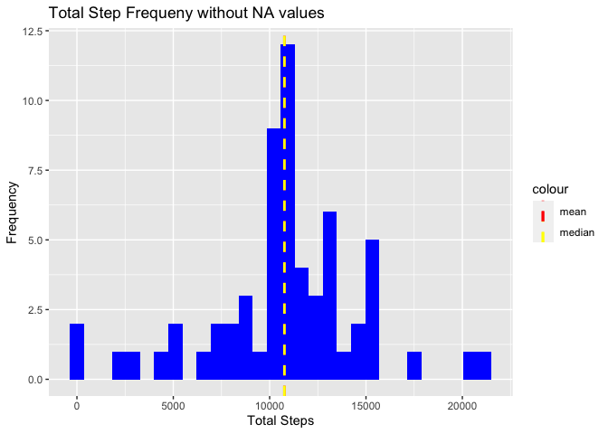
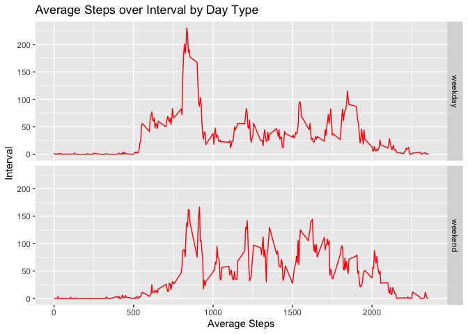

In this project we look at some data taken from wearable fitness devices. The data contains 3 variables,
steps-the amount of steps taken in a 5 min interval
date-the date the observation was taken
interval-the 5 minute interval in question

## Loading and preprocessing the data
This code will load in our dataset from the url, and unzip it.
The last line removes scientific notation, which will be necessary for our analysis

```r
# Download zip file if it doesn't already exist in the workspace
dataurl <- "https://d396qusza40orc.cloudfront.net/repdata%2Fdata%2Factivity.zip"
if (!file.exists("activity.zip")) {
  download.file(dataurl, destfile = "activity.zip", method = "curl")
}
# Unzip data
datafile <- "activity.csv"
if (!file.exists(datafile)) {
  unzip(zipfile = "activity.zip")
}
# Load data
activity <- read.csv(datafile, header = TRUE)
options(scipen = 100)
```


## What is mean total number of steps taken per day?

```r
library(dplyr)
```

```
## 
## Attaching package: 'dplyr'
```

```
## The following objects are masked from 'package:stats':
## 
##     filter, lag
```

```
## The following objects are masked from 'package:base':
## 
##     intersect, setdiff, setequal, union
```

```r
steps_date <- select(activity, steps, date, interval) %>%
  group_by(date) %>% summarize(total_steps = sum(steps, ra.rm = TRUE))
```
Quick line to make the NA values = 0

```r
steps_date[is.na(steps_date)] = 0
```
Now let's look at our new data frame, steps_date

```r
head(steps_date)
```

```
## # A tibble: 6 x 2
##   date       total_steps
##   <fct>            <dbl>
## 1 2012-10-01           0
## 2 2012-10-02         127
## 3 2012-10-03       11353
## 4 2012-10-04       12117
## 5 2012-10-05       13295
## 6 2012-10-06       15421
```

Now that we have our data the way we want it, we can find the mean and median,
and then make our histogram. 

First, let's find the mean and the median, because we want those on the plot


```r
mean_steps <- with(steps_date, mean(total_steps))
median_steps <- with(steps_date, median(total_steps))
```
To make the histogram we will use ggplot

```r
library(ggplot2)
a <- ggplot(steps_date, aes(total_steps))
a + geom_histogram(fill = 'blue') + labs(title = 'Total Step Frequency', x = 'Total Steps', y = 'Frequency') +
  geom_vline(aes(xintercept = mean_steps, color = 'mean'), linetype = 'dashed', size = 1) +  
  geom_vline(aes(xintercept = median_steps, color = 'median'), linetype = 'dashed',  size = 1) + 
  scale_color_manual(values = c(mean = 'red', median = 'yellow'))
```

```
## `stat_bin()` using `bins = 30`. Pick better value with `binwidth`.
```

<!-- -->


The mean number of total steps is 9355.1 and is denoted by the red line.
The median number of total steps is 10396 and is denoted by the yellow line.

## What is the average daily activity pattern?

```r
steps_interval <- select(activity, steps, date, interval) %>%
  group_by(interval) %>% summarize(average_steps = mean(steps, na.rm = TRUE))
```
Here is what our new data frame, steps_interval looks like

```r
head(steps_interval)
```

```
## # A tibble: 6 x 2
##   interval average_steps
##      <int>         <dbl>
## 1        0        1.72  
## 2        5        0.340 
## 3       10        0.132 
## 4       15        0.151 
## 5       20        0.0755
## 6       25        2.09
```

Let's calculate the maximum average steps, and the interval where that max occurs

```r
max_average_steps <- max(steps_interval$average_steps)
max_average_steps_interval <- steps_interval[
  steps_interval$average_steps == max_average_steps,]$interval
```

Now we make the plot

```r
b <- ggplot(steps_interval, aes(interval, average_steps))
b + geom_line(color = 'blue') + labs(title = 'Average Steps by Interval', x = 'Interval', y = 'Average Steps') + 
  geom_hline(aes(yintercept = max_average_steps, color = 'max'), linetype = 'dashed', size = 1) +
  geom_vline(aes(xintercept = max_average_steps_interval, color = 'interval'), linetype = 'dashed',  size = 1) +
  scale_color_manual(values = c(max = 'red', interval = 'green'))
```

<!-- -->

## Imputing missing values
First, let's just see how many missing values there are

```r
na_amount <- nrow(activity[which(is.na(activity$steps)),])
```
There are 2304 missing values in our activity dataset, which skews our data 
and makes it difficult to conduct analysis
So, let's see if we can fix that

```r
cleaned_activity <- activity
```
That line just made a copy of the dataset, now we are going to for-loop through 
our data, and replace every missing step value with the average steps from that interval

```r
for (i in 1:nrow(cleaned_activity)){
  if (is.na(cleaned_activity$steps[i])){
    int <- cleaned_activity$interval[i]
    avg <- steps_interval[steps_interval$interval==int,]$average_steps
    cleaned_activity$steps[i] <- avg
    
  }
}
```
Let's look at the new data frame

```r
head(cleaned_activity)
```

```
##       steps       date interval
## 1 1.7169811 2012-10-01        0
## 2 0.3396226 2012-10-01        5
## 3 0.1320755 2012-10-01       10
## 4 0.1509434 2012-10-01       15
## 5 0.0754717 2012-10-01       20
## 6 2.0943396 2012-10-01       25
```

Now we can conduct the same analysis we did in the first part, but with our new cleaned data

```r
cleaned_steps_date <- select(cleaned_activity, steps, date, interval) %>%
  group_by(date) %>% summarize(total_steps = sum(steps, ra.rm = TRUE))
```
Finding the mean and median again:

```r
cleaned_mean_steps <- with(cleaned_steps_date, mean(total_steps))
cleaned_median_steps <- with(cleaned_steps_date, median(total_steps))
```

Make the histogram again

```r
c <- ggplot(cleaned_steps_date, aes(total_steps))
c + geom_histogram(fill = 'blue') + labs(title = 'Total Step Frequeny without NA values', x = 'Total Steps', y = 'Frequency') +
  geom_vline(aes(xintercept = cleaned_mean_steps, color = 'mean'), linetype = 'dashed', size = 1) +  
  geom_vline(aes(xintercept = cleaned_median_steps, color = 'median'), linetype = 'dashed',  size = 1) + 
  scale_color_manual(values = c(mean = 'red', median = 'yellow'))
```

```
## `stat_bin()` using `bins = 30`. Pick better value with `binwidth`.
```

<!-- -->


In the new data, our mean and median are actually the same, 10767.19. 
This is denoted by the yellow dashed line. 

## Are there differences in activity patterns between weekdays and weekends?
Let's make add some new columns to the data frame, 
'weekday' which tells us the day of the week and
'weekday_type' which tells us weekday or weekend

```r
activity_weekday <- mutate(cleaned_activity, 
                    weekday = weekdays(as.Date(cleaned_activity$date)),
                    weekday_type = as.factor(ifelse(weekday=="Saturday" | weekday=="Sunday", "weekend", "weekday")))
```
Let's look at that new dataset

```r
head(activity_weekday)
```

```
##       steps       date interval weekday weekday_type
## 1 1.7169811 2012-10-01        0  Monday      weekday
## 2 0.3396226 2012-10-01        5  Monday      weekday
## 3 0.1320755 2012-10-01       10  Monday      weekday
## 4 0.1509434 2012-10-01       15  Monday      weekday
## 5 0.0754717 2012-10-01       20  Monday      weekday
## 6 2.0943396 2012-10-01       25  Monday      weekday
```

Now we get the average steps for weekend/weekday and interval

```r
summary_weekday <- select(activity_weekday, steps, date, interval, weekday_type) %>% 
  group_by(weekday_type, interval) %>% 
  summarize(average_steps = mean(steps, na.rm = TRUE))
```
And finally, making the plot


```r
d <- ggplot(summary_weekday, aes(interval, average_steps))
d + geom_line(color = 'red') + facet_grid(weekday_type ~.) +
  labs(title = 'Average Steps over Interval by Day Type', x = 'Average Steps', y = 'Interval')
```

<!-- -->
